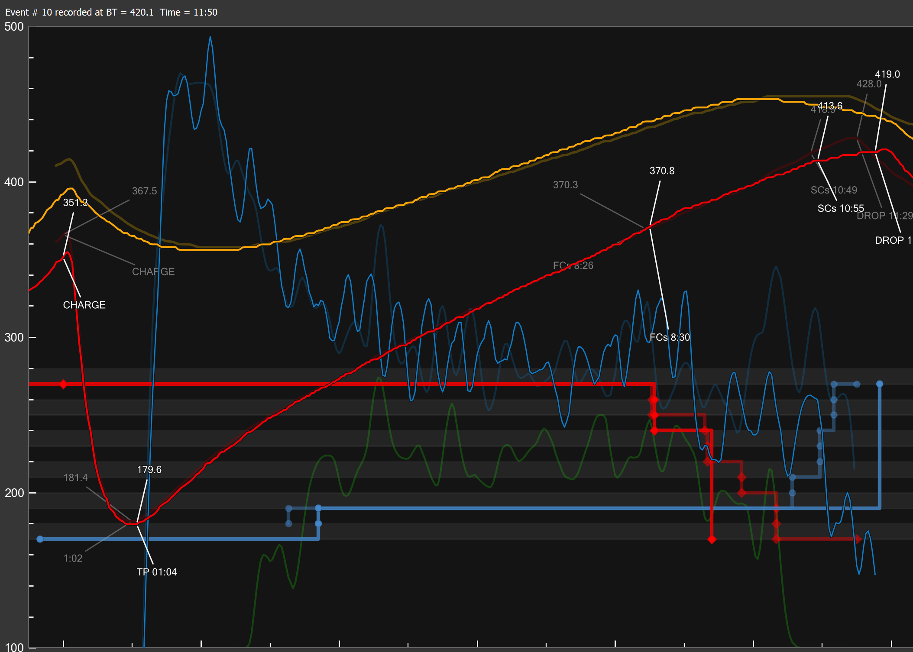
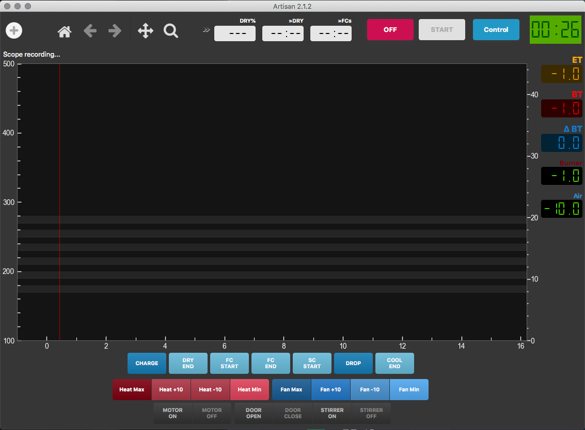

# Artisan Roast Profiles and Themes for my Hottop 2k+

Check out the Artisan Roaster Scope repo [here](https://github.com/artisan-roaster-scope/artisan), and the website [here](https://artisan-scope.org/)

This is storage for my Artisan roast profiles, themes and settings.

## Example Roast Profile

I've been working on slowing the rate of rise into second crack and this profile was the first time I came in exactly the way I wanted do. The Hottop holds some heat in the element, you can see them glowing after the power is removed, so it's always about adjusting for the future of the roast.

## HyperSprite Dark Theme

Theme [here](themes/artisan-theme-hs-dark.athm)
Settings [here](settings/hs-artisan-settings.aset)

This is my current dark theme and button layout.
